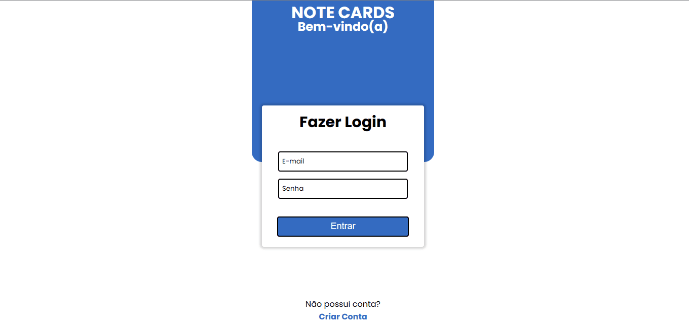

# Note Cards

## This is my Note Cards project. 

### The purpose of this project was so that I could put into practice my studies in the technologies used. 

#### The back-end was developed using: Java | Spring Boot | PostgreSQL | 

#### The front-end was developed with: React | TypeScript | Context API | Axios | React-Query | React Router |

---

---

**Author: Jonas Dias | [Social Media](https://jonas-dias.netlify.app/) | Thank You**